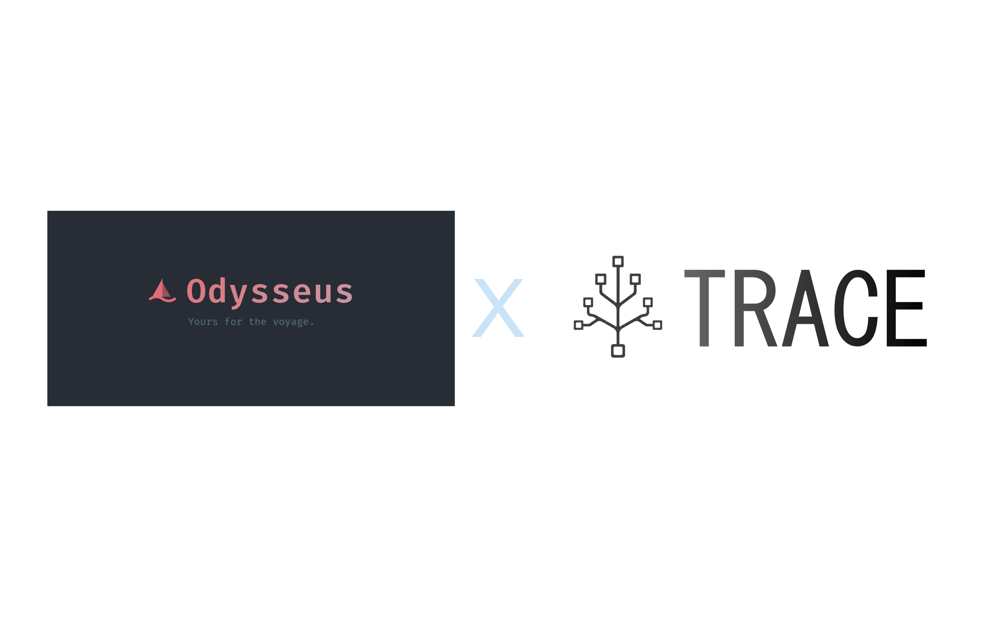

# Odysseus + TRACE Engine
<p align="center">
  
</p>

<p align="center">
  A self-hosted AI workspace for chat, agents, research, documents, email, notes, calendar, and local model workflows.
</p>



<p align="center">
  <a href="#quick-start">Quick Start</a> ·
  <a href="docs/setup.md">Setup Guide</a> ·
  <a href="CONTRIBUTING.md">Contributing</a> ·
  <a href="ROADMAP.md">Roadmap</a>
</p>

<p align="center">
  <a href="https://repology.org/project/odysseus-ai/versions"></a>
</p>

## ⚡ The TRACE Memory Engine

This optimized fork integrates **TRACE**, a custom 2,000-line memory architecture engineered for high-performance, long-running agentic tasks. TRACE replaces the standard flat sliding-window memory model with a hierarchical, searchable **B+Tree architecture** backed by an async SQLite thread-pool. It surgically retrieves only the exact context the agent needs.

### Performance
- **~31% reduction** in token consumption.
- **Perfect fact recall** across massive context windows.
- **Zero latency degradation** during retrieval operations.

## Features
  - **Chat** -- chat with any local model or API; adding them is super simple.<br>　<sub>vLLM · llama.cpp · Ollama · OpenRouter · OpenAI · GitHub Copilot</sub>
  - **Agent** -- hand it tools and let it run the whole task itself.<br>　<sub>built on [opencode](https://github.com/anomalyco/opencode) · MCP · web · files · shell · skills · memory</sub>
  - **Cookbook** -- Scans your hardware, recommends models, click to download and serve.. easy!<br>　<sub>built on [llmfit](https://github.com/AlexsJones/llmfit) · VRAM-aware · GGUF / FP8 / AWQ · fit scoring · vLLM / llama.cpp serving</sub>
  - **Deep Research** -- multi-step runs that gather, read, and synthesize sources into a nice visual report.<br>　<sub>adapted from [Tongyi DeepResearch](https://github.com/Alibaba-NLP/DeepResearch)</sub>
  - **Compare** -- a fun tool to compare models side by side. Test completely blind, no bias!<br>　<sub>multi-model · blind test · synthesis</sub>
  - **Documents** -- YOU write the text, AI is there to assist, not the opposite.<br>　<sub>multi-tab editor · markdown · HTML · CSV · syntax highlighting · AI edits · suggestions</sub>
  - **Memory / Skills** -- Persistent memory and skills, your agent evolves over time as it better understands you and your tasks!<br>　<sub>ChromaDB · fastembed (ONNX) · vector + keyword retrieval · import/export</sub>
  - **Email** -- IMAP/SMTP inbox with AI triage built in: urgency reminders, auto-tag, auto-summary, auto-reply drafts, auto-spam.<br>　<sub>IMAP · SMTP · per-account routing · CalDAV-aware</sub>
  - **Notes & Tasks** -- Quick notes with reminders, a todo list, and scheduled tasks the agent can act on.<br>　<sub>note pings · checklist · cron-style tasks · ntfy / browser / email channels</sub>
  - **Calendar** -- Local-first calendar with CalDAV sync to Radicale / Nextcloud / Apple / Fastmail.<br>　<sub>CalDAV pull · .ics import/export · per-calendar colors · agent-aware</sub>
  - **Works on mobile** -- looks and runs great on your phone, not just desktop.<br>　<sub>responsive · installable (PWA) · touch gestures</sub>
  - **Extras** -- more to explore, happy if you give it a go!<br>　<sub>image editor · theme editor · file uploads (vision + PDF) · web search · presets · sessions · 2FA</sub>

<p align="center">
  
</p>

---

## Quick Start

> `dev` is the default branch and gets the newest changes first. Use [`main`](https://github.com/pewdiepie-archdaemon/odysseus/tree/main) if you want the more curated branch.

```bash
git clone https://github.com/pewdiepie-archdaemon/odysseus.git
cd odysseus
cp .env.example .env
docker compose up -d --build
```

Open `http://localhost:7000` when the containers are healthy. The first admin password is printed in `docker compose logs odysseus`.

Native installs, GPU notes, Windows/macOS instructions, HTTPS, and configuration live in the [setup guide](docs/setup.md).

## Features

- **Chat + Agents** — local/API models, tools, MCP, files, shell, skills, and memory.
- **Cookbook** — hardware-aware model recommendations, downloads, and serving.
- **Deep Research** — multi-step web research with source reading and report generation.
- **Compare** — blind side-by-side model testing and synthesis.
- **Documents** — writing-first editor with AI edits, suggestions, Markdown, HTML, CSV, and syntax highlighting.
- **Email** — IMAP/SMTP inbox with triage, tags, summaries, reminders, and reply drafts.
- **Notes, Tasks + Calendar** — reminders, todos, scheduled agent tasks, and CalDAV sync.
- **Extras** — gallery/image editor, themes, uploads, web search, presets, sessions, and 2FA.

## Demo

A full hover-to-play tour lives on the landing page: [`docs/index.html`](docs/index.html).

## Contributing

Help is welcome. The best entry points are fresh-install testing, provider setup bugs, mobile/editor polish, docs, and small focused refactors. See [CONTRIBUTING.md](CONTRIBUTING.md) and [ROADMAP.md](ROADMAP.md).

## Security

Odysseus is a self-hosted workspace with powerful local tools. Keep auth enabled, keep private data out of Git, and do not expose raw model/service ports publicly. Deployment details are in the [setup guide](docs/setup.md#security-notes).

## Star History

<a href="https://www.star-history.com/?repos=pewdiepie-archdaemon%2Fodysseus&type=date&legend=top-left">
 <picture>
   <source media="(prefers-color-scheme: dark)" srcset="https://api.star-history.com/chart?repos=pewdiepie-archdaemon/odysseus&type=date&theme=dark&legend=top-left" />
   <source media="(prefers-color-scheme: light)" srcset="https://api.star-history.com/chart?repos=pewdiepie-archdaemon/odysseus&type=date&legend=top-left" />
   
 </picture>
</a>

## License

AGPL-3.0-or-later -- see [LICENSE](LICENSE) and [ACKNOWLEDGMENTS.md](ACKNOWLEDGMENTS.md).
